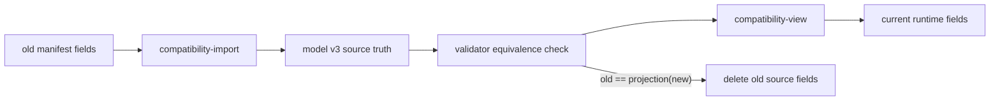
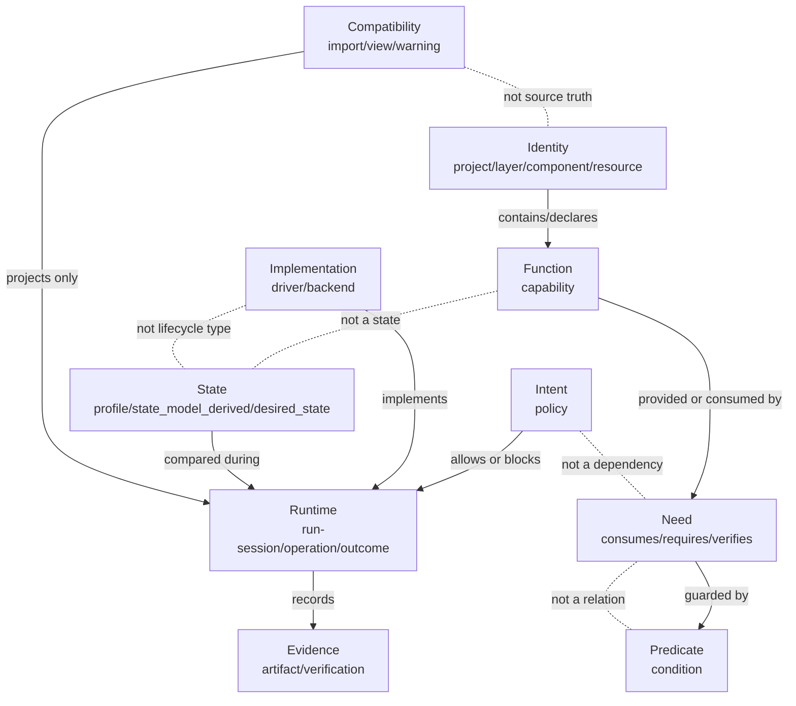

# 10 - Visual Model

This diagram shows the goal model as three coordinated layers:

- static declaration model;
- executable contract model;
- compatibility projection model.

```mermaid
flowchart TB
  %% ---------------------------
  %% Static declaration model
  %% ---------------------------
  subgraph STATIC["Static Declaration Model"]
    Project["project"]
    Layer["layer"]
    Component["component"]
    Template["resource-template"]
    Resource["managed-resource"]
    Capability["capability"]
    ProviderSelection["provider-selection"]
    Condition["condition-ast"]
    Policy["policy"]
    Preflight["preflight-control"]
    Verification["verification-test"]
    OutputContract["output-contract"]
    Driver["driver-contract"]
    Backend["backend-contract"]
    Derived["derived-artifact"]
    Governance["governance-claim"]
  end

  Project -->|"contains"| Layer
  Layer -->|"contains"| Component
  Component -->|"contains"| Resource
  Component -->|"declares"| Template
  Template -->|"generates"| Resource
  Resource -->|"provides"| Capability
  Resource -->|"consumes hard/soft"| Capability
  Resource -->|"requires"| Condition
  Resource -->|"declares output"| OutputContract
  OutputContract -->|"provides"| Capability
  ProviderSelection -->|"selects provider for"| Capability
  ProviderSelection -->|"chooses"| Resource
  Policy -->|"allows/blocks"| Resource
  Preflight -->|"gates run"| Condition
  Verification -->|"verifies"| Capability
  Resource -->|"uses"| Driver
  Driver -->|"uses"| Backend
  Driver -->|"implies consumes/provides"| Capability
  Backend -->|"implies consumes/provides"| Capability
  Project -->|"generates"| Derived
  Project -->|"claims"| Governance

  %% ---------------------------
  %% Executable contract model
  %% ---------------------------
  subgraph RUN["Executable Contract Model"]
    Host["host-context"]
    Session["run-session"]
    Selection["selection-plan"]
    Plan["execution-plan"]
    Operation["resource-operation"]
    Outcome["operation-outcome"]
    Inhibitor["transition-inhibitor"]
    Cache["observation-cache"]
    Artifact["run-artifact"]
    VContext["verification-context"]
  end

  Session -->|"uses"| Host
  Session -->|"resolves"| Selection
  Selection -->|"selects resources"| Resource
  Selection -->|"builds"| Plan
  Plan -->|"schedules"| Operation
  Operation -->|"executes"| Resource
  Operation -->|"reads/writes"| Cache
  Operation -->|"produces"| Outcome
  Operation -->|"produces when blocked"| Inhibitor
  Operation -->|"records"| Artifact
  VContext -->|"runs"| Verification
  VContext -->|"reads"| Artifact

  %% ---------------------------
  %% Compatibility projection
  %% ---------------------------
  subgraph COMPAT["Compatibility Projection Model"]
    Import["compatibility-import"]
    View["compatibility-view"]
    Warning["compatibility-warning"]
    OldDeps["old depends_on"]
    OldSoft["old soft_depends_on"]
    OldRequires["old requires"]
    OldTrace["old trace"]
    OldAdmin["old admin_required"]
  end

  Import -->|"reads legacy fields into v3"| Resource
  Resource -->|"projects"| View
  View -->|"emits"| OldDeps
  View -->|"emits"| OldSoft
  View -->|"emits"| OldRequires
  View -->|"emits"| OldTrace
  View -->|"emits"| OldAdmin
  Warning -->|"reports divergence"| View

  %% ---------------------------
  %% Replacement invariant
  %% ---------------------------
  Capability -. "source truth" .-> View
  Condition -. "source truth" .-> View
  Policy -. "source truth" .-> View
  Verification -. "source truth" .-> View
  Driver -. "source truth" .-> View
  Backend -. "source truth" .-> View

  classDef source fill:#e7f0ff,stroke:#476fbe,color:#10233f;
  classDef run fill:#e9f7ef,stroke:#37845a,color:#123522;
  classDef compat fill:#fff4df,stroke:#a66a00,color:#3a2600;
  classDef old fill:#f7e7e7,stroke:#a34747,color:#3a1212;

  class Project,Layer,Component,Template,Resource,Capability,ProviderSelection,Condition,Policy,Preflight,Verification,OutputContract,Driver,Backend,Derived,Governance source;
  class Host,Session,Selection,Plan,Operation,Outcome,Inhibitor,Cache,Artifact,VContext run;
  class Import,View,Warning compat;
  class OldDeps,OldSoft,OldRequires,OldTrace,OldAdmin old;
```

## Replacement Flow

## Orthogonality Map

