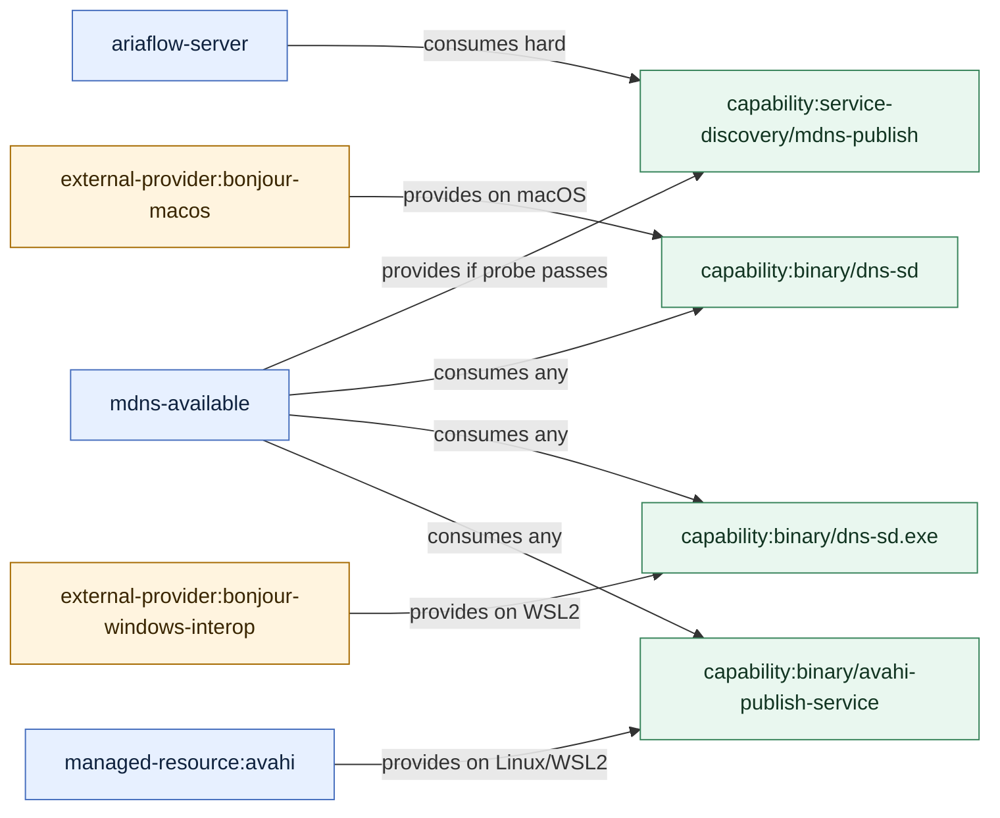

# 11 - Avahi And Bonjour Declination

This is a concrete model-v3 declination for the current `network-services`
implementation.

## Current Live Shape

From `ucc/software/network-services.yaml`:

| Resource | Role today |
|---|---|
| `mdns-available` | Observe-only capability resource for mDNS/Bonjour availability |
| `avahi` | Linux/WSL2 package resource installing `avahi-utils` through native package manager |
| `ariaflow-server` | macOS-only runtime resource; depends on `networkquality-available?macos`, `mdns-available`, and `avahi?linux,wsl2` |
| `ariaflow-dashboard` | macOS-only runtime resource; depends on `mdns-available` |

Current probe behavior:

```text
mdns_is_available
  macOS  -> dns-sd
  Linux  -> avahi-publish-service
  WSL2   -> dns-sd.exe through Windows interop, or avahi-publish-service
```

## Important Modeling Correction

Bonjour and Avahi are not modeled as the same kind of element.

| Name | Model role | Why |
|---|---|---|
| Bonjour / `dns-sd` | external/native provider | Built into macOS, or available through Windows interop on WSL2; not converged by this repo |
| Avahi / `avahi-utils` | managed resource and provider | Installed by the repo on Linux/WSL2 through native package manager |
| `mdns-available` | abstract capability resource | Observes whether some provider makes mDNS publishing available |
| mDNS publishing | capability | Functional surface consumed by services |

So the source truth is:

```text
Ariaflow consumes service-discovery:mdns-publish.
mdns-available provides service-discovery:mdns-publish when its probe passes.
mdns-available is satisfied by either Bonjour/dns-sd or Avahi tooling.
Avahi is only one possible provider, not the capability itself.
```

## Capability Registry

```yaml
capabilities:
  - id: capability:service-discovery/mdns-publish
    capability_type: service-discovery
    name: mdns-publish
    capability_scope: host
    external: false
    qualifiers:
      protocol: mdns

  - id: capability:binary/dns-sd
    capability_type: binary
    name: dns-sd
    capability_scope: host
    external: true
    qualifiers:
      provider: bonjour
      platform: macos

  - id: capability:binary/dns-sd.exe
    capability_type: binary
    name: dns-sd.exe
    capability_scope: host
    external: true
    qualifiers:
      provider: bonjour-windows-interop
      platform: wsl2

  - id: capability:binary/avahi-publish-service
    capability_type: binary
    name: avahi-publish-service
    capability_scope: host
    external: false
    qualifiers:
      provider: avahi
```

## Providers

### Bonjour Provider

Bonjour is not a managed resource. It is an external provider.

```yaml
bonjour-macos:
  element_type: external-provider
  provides:
    - capability:binary/dns-sd
  requires:
    equals:
      fact: platform
      value: macos
```

For WSL2 interop:

```yaml
bonjour-windows-interop:
  element_type: external-provider
  provides:
    - capability:binary/dns-sd.exe
  requires:
    equals:
      fact: platform_variant
      value: wsl2
```

### Avahi Provider

Avahi is a managed resource.

```yaml
avahi:
  element_type: managed-resource
  component: network-services
  lifecycle:
    resource_type: package
    convergence_profile_derived: configured
    state_model_derived: package
  requires:
    any:
      - equals:
          fact: platform
          value: linux
      - equals:
          fact: platform_variant
          value: wsl2
  driver:
    driver_type: pkg
    backends:
      - native-pm: avahi-utils
  relations:
    - relation_type: consumes
      to: capability:package-manager/native-pm
      consumes:
        consume_strength: hard
        relation_effect: block
    - relation_type: provides
      to: capability:binary/avahi-publish-service
      provides:
        provider_scope: host
```

## Abstract mDNS Capability Resource

`mdns-available` stays as the abstraction layer. It avoids making
callers know whether Bonjour or Avahi is the provider.

```yaml
mdns-available:
  element_type: managed-resource
  component: network-services
  lifecycle:
    resource_type: capability
    convergence_profile_derived: capability
  driver:
    driver_type: capability
    probe: mdns_is_available
  relations:
    - relation_type: consumes
      to:
        any:
          - capability:binary/dns-sd
          - capability:binary/dns-sd.exe
          - capability:binary/avahi-publish-service
      consumes:
        consume_strength: hard
        relation_effect: observe
    - relation_type: provides
      to: capability:service-discovery/mdns-publish
      provides:
        provider_scope: host
        satisfaction_rule: probe-passes
```

This is the clean dependency resource for application runtimes:

```yaml
ariaflow-server:
  relations:
    - relation_type: consumes
      to: capability:service-discovery/mdns-publish
      consumes:
        consume_strength: hard
        relation_effect: block
```

## Resolved Views

The old executable graph can still be generated.

### macOS

```text
bonjour-macos provides binary:dns-sd
mdns-available consumes binary:dns-sd
mdns-available provides service-discovery:mdns-publish
ariaflow-server consumes service-discovery:mdns-publish

resolved depends_on:
  ariaflow-server -> mdns-available
```

No `avahi` edge is needed on macOS.

### Linux

If an Ariaflow Linux runtime exists later:

```text
avahi provides binary:avahi-publish-service
mdns-available consumes binary:avahi-publish-service
mdns-available provides service-discovery:mdns-publish
ariaflow-server-linux consumes service-discovery:mdns-publish

resolved depends_on:
  mdns-available -> avahi
  ariaflow-server-linux -> mdns-available
```

### WSL2

WSL2 can have two possible providers:

```text
Option A: Windows Bonjour interop provides binary:dns-sd.exe
Option B: Avahi provides binary:avahi-publish-service

mdns-available consumes either provider.
```

This is modeled as an ordered provider preference, not as a direct
runtime dependency on Avahi.

```yaml
provider_selection:
  capability: capability:service-discovery/mdns-publish
  strategy: first-available
  candidates:
    - provider: bonjour-windows-interop
      condition:
        equals:
          fact: platform_variant
          value: wsl2
    - provider: avahi
      condition:
        any:
          - equals:
              fact: platform
              value: linux
          - equals:
              fact: platform_variant
              value: wsl2
```

## Current Model Warning

The live manifest has this edge:

```yaml
ariaflow-server:
  requires: macos
  depends_on:
    - avahi?linux,wsl2
```

In model v3, that is a contradiction:

```text
resource requires macos
dependency condition requires linux or wsl2
intersection is empty
```

So the goal validator reports:

```text
warning: ariaflow-server has unreachable dependency relation avahi?linux,wsl2
because resource condition macos and dependency condition linux,wsl2 cannot both hold
```

There are two possible fixes:

| Intended behavior | Goal model |
|---|---|
| Ariaflow remains macOS-only | Remove the `avahi?linux,wsl2` runtime edge and let `mdns-available` abstract Bonjour |
| Ariaflow becomes cross-platform | Split or widen the runtime resource and let Linux/WSL2 consume `service-discovery:mdns-publish` through `mdns-available` |

## Orthogonality Check

| Concept | Correct owner | Not owner |
|---|---|---|
| Bonjour | external provider | managed resource |
| Avahi | managed package provider | generic mDNS capability |
| `mdns-available` | capability observation resource | package provider |
| mDNS publish | service-discovery capability | resource, package, or driver |
| `ariaflow-server` dependency | consumes mDNS capability | direct Avahi/Bonjour implementation detail |
| platform choice | condition/provider selection | dependency identity |

## Visual Declination



## Result

The clean model is:

```text
application runtime -> consumes mDNS capability
mdns-available      -> observes and provides mDNS capability
Bonjour             -> external provider of dns-sd
Avahi               -> managed provider of avahi-publish-service
provider selection  -> chooses usable provider by host condition
```

This removes the current implementation leak where a macOS-only runtime names
the Linux Avahi package directly.
